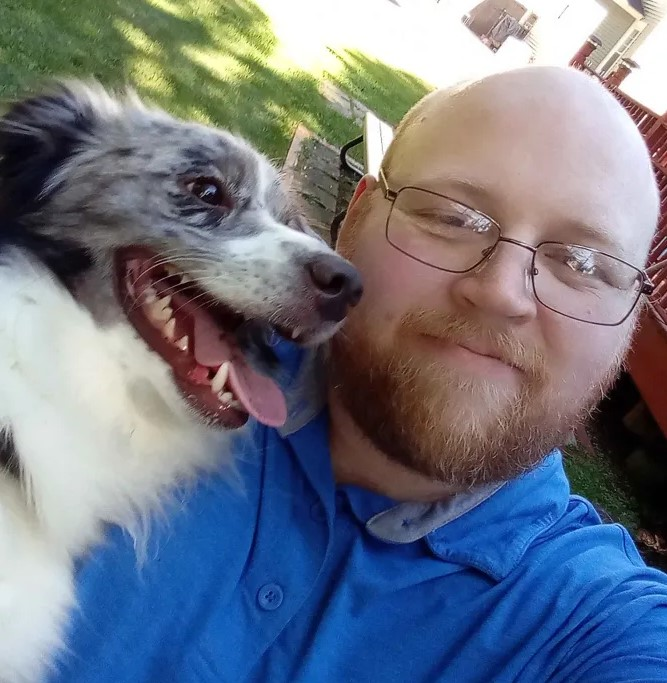
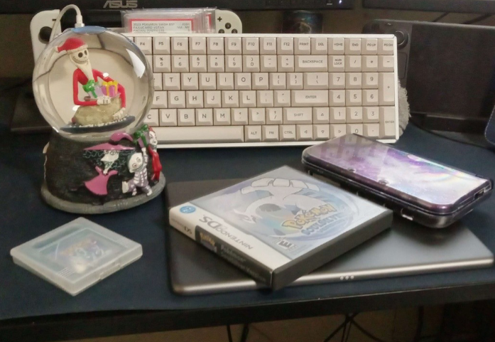
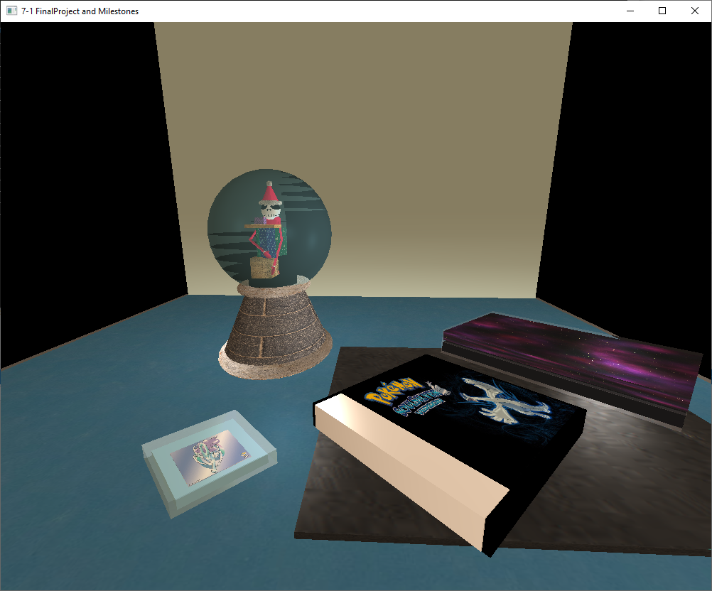
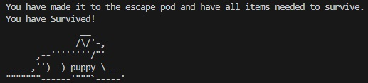
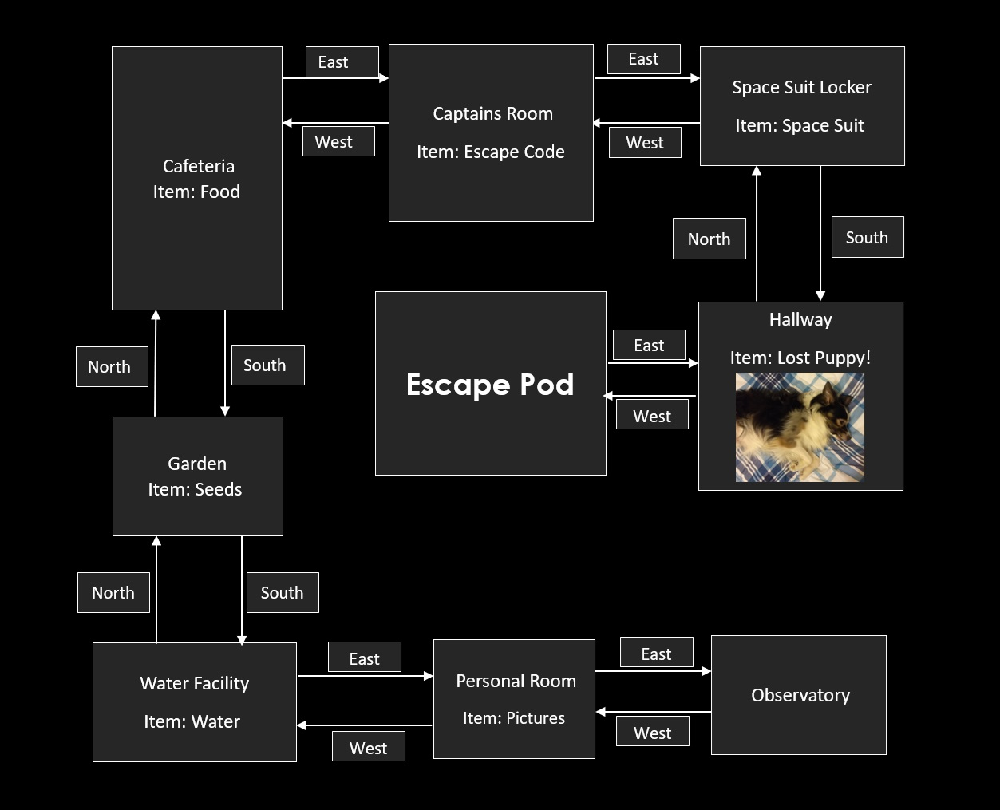
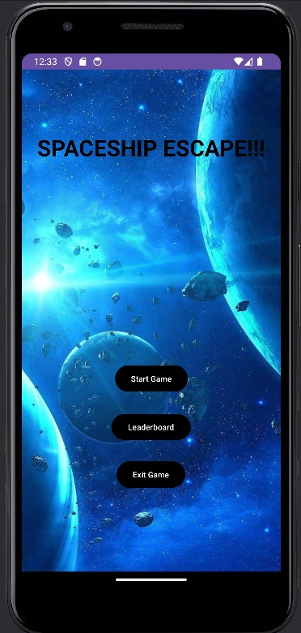
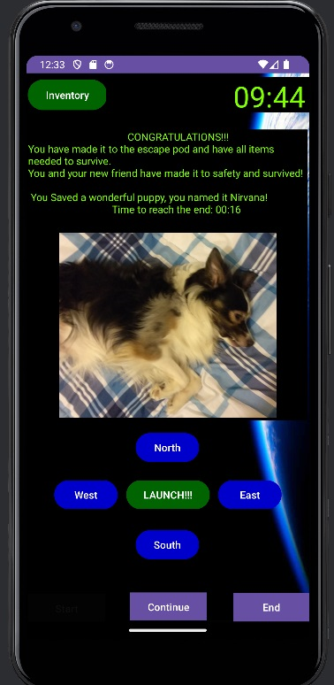
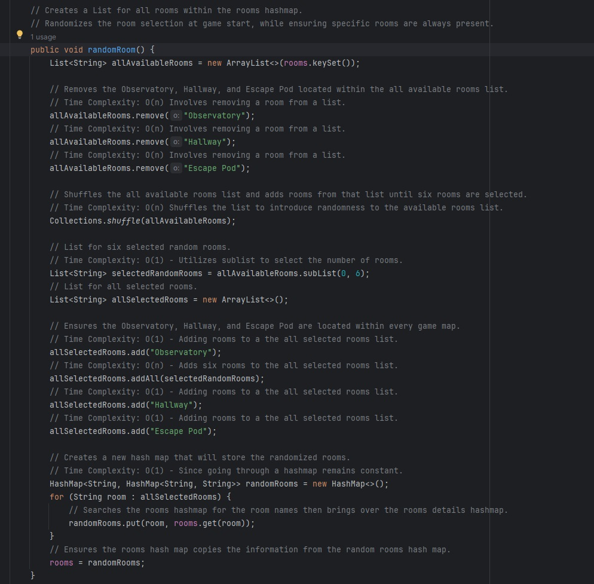
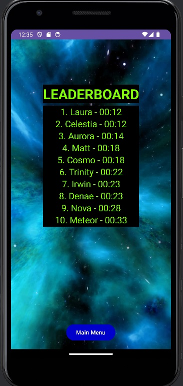
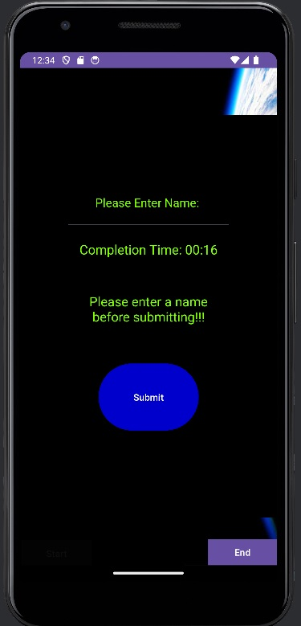

# About Me:

My name is Mark Irwin and welcome to my ePortfolio. I currently live in New York and have been studying computer science for many years. 
I love to learn, and excited to continue gaining experience and insight within the field of computer science.

# Table of Contents
 - [Professional Self-Assessment](#Professional-Self-Assessment)
 - [Artifact Infomation](#artifact-information)
 - [Code Review](#code-review)
 - [Enhancement One: Software Design and Engineering](#enhancement-one-software-design-and-engineering)
 - [Enhancement Two: Algorithms and Data Structure](#enhancement-two-algorithms-and-data-structure)
 - [Enhancement Three: Databases](#enhancement-three-databases)

# Professional Self-Assessment

My passion for computer science and the endless opportunites that come with it have only grown since studying at South New Hampshire University. Throughout my time at SNHU my understanding and skills have developed into a skill set that has prepared me for the technical field of computer science. While working on my computer science capstone I have been able to not only refine my technical skills but also showcase showcase my strengths while also helping to enhance my professional goals. During the Computer Science program at SNHU I was able to get a strong support structure to encourage learning but also experience not only in technical projects but also group environemnts. I have developed many applications throughout my time in university, one that really showcases my graphical prowess and strong understanding of an applications goals would involve a project for cs330 which involves recreating a picture you take within a 3D environment utilizing OpenGL. 

This project was based on recreating an image you took that needed to have a specific amount of objects within view. I decided to make the project more complicated to help showcase my expertise by introdusing clear layers and a snow globe that features clear glass and a figure within it. Utilizing the shapes we were given to create the objects within the picture although limiting did help explore my creativity and help me reach the goals of the assignment in a way that I felt would help showcase my understanding working with OpenGL.

My expertise, skills, and mindset when working within a team environment has been sharpened thanks to my time at SNHU. I have a strong understanding of the mindset you should have within a team environment and how to not only adjust to change but also excel. I also have first hand experience working within the SCRUM mindset and have a strong understanding of the SCRUM roles and goals. My understanding and expertise is only one topic that I have been able to grow expertise in, Communicating with stakeholders and users has also been an extremely important area of focus within my studies and development process. I have developed a goal and development focused mindset while ensuring I take into consideration not only the stakeholders needs but also the users needs. Ensuring I have a strong foundational understanding of how to communite the goals of the stakeholders and the needs of the users is a skill that I have been able to develop through my time at SNHU. Data structures, algorithms, software engineering, and databases were all intrgral to my learning process and throughout my time at SNHU I was able to grow a strong understanding and expertise in each of these areas. I utilized my knowledge of Data structures and Algorithms to help optimize performance within my application. My expertise in Software Engineering ensured my code was maintainable, scalable, and user friendly. My database utilization helped maintain data integrity, organization and efficiency throughout my projects. By Utilizing databases within my projects I was able to ensure my data could be accessed through the application while also ensuring data collected was safe and secure. The security mindset I developed during my time of SNHU helped showcased my dedication and expertise in keeping applications, and information secure and safe from outside eyes. Security is of major importance and ensuring users continue to trust applications I work on is of extreme importance. Ensuring my ethics for computer science and my integrity are firm help ensure safe developmental practices that do not harm the users or put any users at risk. Ethics are extremely important to not only the applications success but also to the saftey of the users and the company image.

For my Computer Science Capstone I utilized only one Artifact, the artifact I chose was Called SpaceShip Escape!!! and each enhancement I made on the application helped showcase my skills and expertise when demonstrating my computer science abilities. Within this ePortfolio I have showcase the following skills and abilities:

- Ensuring and Promoting a collaborative coding environment.
- Highly detailed code documention, functionality, and details.
- Encourage code adaptation and improvement through well designed code.
- Showcasing high level understanding of code and gameplay.
- Support future code enhancements by other developers.
- Android Studio Environment utilization and adaptation.
- Supporting a strong understanding for UI/UX Design.
- Imrpoved application navigation and audience engagement.
- Strong understanding of optimizing code and increasing efficiency.
- Utilizing algorithmic logic to ensure smooth application processes.
- Database utilization and integration within an application.
- Ability to utilize a wide range of unique databases such as MongoDB and Firebase.
- Understanding data requirements and best database solution.
- CRUD Development and Utilization.
- Android Studio Utilization and the Mobile environment for development.
- Security mindset utilizing best practices to ensure the safety of the application and user data.
- Data Validation and Data Encryption.
- Application expansion and adaptation during the development process.

# Artifact Information

The artifact I have chosen is called Spaceship Escape it was a project from IT140. It is a text-based adventure game that was originally made in python. I created the code for the project in python within my first semesters at South New Hampshire University when I was in IT140. 

Spaceship Escape!!! - The spaceship you are on has been damaged by asteroids and more are coming! You need to gather items needed to survive and find the code that will allow you to launch the escape pod. Because the spaceship has been damaged only Nine rooms remain active. The nine rooms are the Starting room which is the Observatory, Your room which contains personal pictures, the Water Facility which you can get water from, the Garden which will have seeds, the Cafeteria which will allow you to grab food for the trip, the Captains Room which has the escape pod launch codes, the Space Suit Locker room to grab a space suit from, the Hallway which has a lost puppy, and finally the final room the Escape Pod. Gather all Seven items and escape to freedom from the burning spaceship. But be careful another cloud of asteroids are coming; You do not have long before the entire ship will be destroyed. 

# Storyboard: Map
Here is the layout of the spacheship rooms that survived, and the items needed to help navigate your quest.

# Code Review

A visual look into my original python code for Spaceship escape and a breakdown on planned enhancements.

<iframe width="560" height="315" src="https://www.youtube.com/embed/USr-XpeMr74" frameborder="0" allow="accelerometer; autoplay; clipboard-write; encrypted-media; gyroscope; picture-in-picture" allowfullscreen></iframe>

# Enhancement One: Software Design and Engineering

 

I chose this artifact for my ePortfolio as it would allow me to not only return to one of the first projects, I developed but also showcase how far I have come. This artifact allows me to showcase my skills and abilities in software development by showcasing my ability to write in multiple languages, meet expectations regardless of language, showcase my ability to adapt to new coding environments to enhance functionality, and adapting to challenges. I improved the artifact by not only converting it from Python to Java but also utilizing the conversion within Android Studio making it a fully functional mobile application.

With this enhancement I met the following course outcomes:

 “Employ strategies for building collaborative environments that enable diverse audiences to support organizational decision making in the field of computer science.”
 
-	I showcased and met this outcome by ensuring and promoting a collaborative coding environment by utilizing well documented code that broke down how my code functioned and the intent of my application. I also made sure that my code was well commented which would allow other developers to easily adjust features of the application. My code is also designed in a way that would allow for further adaptation and improvement to the code.
-	
“Design, develop, and deliver professional-quality oral, written, and visual communications that are coherent, technically sound, and appropriately adapted to specific audiences and contexts.”

-	I showcased and met this outcome by ensuring that communication within my applications code and gameplay was clear. This would allow clear communication not only for the players of the application but also for any future developers that utilize my code. I also ensured that my application was appropriately adapted to the android studio environment and adapted to the needs of the users of that environment. I also utilized a clear user interface design which will help audiences better understand the application navigation.

# Enhancement Two: Algorithms and Data Structure

I chose this artifact for my ePortfolio as it would allow me to not only return to one of the first projects, I developed but also showcase how far I have come. This artifact allowed me to showcase my skills in Algorithms and Data Structures by allowing me to develop algorithms that solve problems within the code and ensuring that I can showcase my experience with Array List and HashMap’s to randomize the games room setup to allow players to experience a new game layout every time they load the game. Spaceship Escape was improved by implementing a timer that would add intensity to the game and more urgency to reach the end while also developing algorithms to randomize the room layout so every time a player started the game the map and layout would be different leading to a new gameplay experience every game. Adding replay value and intensity is healthy for the gameplay experience. 

With this enhancement I met the following course outcomes:

“Design and evaluate computing solutions that solve a given problem using algorithmic principles and computer science practices and standards appropriate to its solution while managing the trade-offs involved in design choices.”

-	I showcased and met this outcome by creating algorithms that would solve the problem of a game timer and of room randomization. With this I have been able to utilize algorithmic principles and computer science practices and standards that were able to appropriately solve the problem at hand. To overcome these challenges, I utilized Array Lists and HashMap’s to better randomize the rooms while also ensuring consistency in room connectivity. With this enhancement I introduced uncertainty and a timer to players of the game. Although this was an initial downside for the player this will add more intensity and engagement for the player base while also introducing a more interactive experience when playing through the game. In order to meet the expectations of the enhancement I also had to keep in mind the potential trade-offs and effects this would have on the original aspect and design of the game. Removing description guides of where the player should move to encourage a more exploration-based gameplay was important to increasing the playability of the game.
  
-	I optimized my code by ensuring the systems I utilized would benefit not only the player but also the efficiency of the games code. I utilized countdown timer for use when working on my in-game timer. Using the built in java tool ensured I the countdown was accurate, updated, and ensured I could avoid having to loop through the timer as I initially attempted to. Time complexity was very important when it came to ensuring consistent usage and efficiency of the game. Utilizing lists, HashMap’s, loops, and timers meant I needed to ensure the game was running smoothly and was optimized appropriately. O(n) complexity was used when going through the rooms of the ship and when setting a timer number. Were as O(1) complexity Was involved when adding or manipulating lists, HashMap’s, and each tick of the timer since those aspects would remain constant. Ensuring the complexity also ensured that each game state would follow the same rules and ensure game completion was always possible.
  
-	The efficiency of Algorithmic logic was important in ensuring the smooth gameplay and running of spaceship escape. By ensuring the countdown timer provided real time accurate feedback and ensuring the timer updated appropriately helped the users gameplay experience and the efficiency in how the system runs. I also focused on adding, removing, and cycling rooms from lists to ensure I could sort the rooms in the order they needed to without needing to do unnecessary checks as I know since the rooms were removed or added it was working as expected.  By ensuring to focus on the optimization, time complexity, and algorithmic logic efficiency elements I was able to ensure the game was accurate, efficient, and engaging to the player experience.

# Enhancement Three: Databases

 

I chose this artifact for my ePortfolio as it would allow me to not only return to one of the first computer science projects, I ever developed but also showcase how far I have come throughout my time in university. I knew Spaceship Escape has so much potential in how I can better enhance it. This artifact will allow me to showcase my skills with databases by allowing me to utilize a database so that I can have a real time updated leaderboard within Spaceship Escape that will track the players with the fastest completion times. I ensured Spaceship Escape by ensuring full database integration with full Create, Read, Update, and Delete Functionality. Once a player has reached the victory screen, they will be able to continue and proceed to the submit name and completion time screen. Which will then be added to the spaceship escape database. Players will then be able to go to the leaderboard from the main menu and see the top 10 fastest completion times with the respective player names. I also focused on my artifacts security but ensuring authentication requirements for CRUD integration, updated firmware and framework to ensure no out of date vulnerabilities, security awareness, and input validation. With these enhancements I was able to showcase my skills with database integration, utilization, CRUD, Security planning, and framework updates, and security protocol.  

With this enhancement I met the following course outcomes:

“Demonstrate an ability to use well-founded and innovative techniques, skills, and tools in computing practices for the purpose of implementing computer solutions that deliver value and accomplish industry-specific goals (software engineering/design/database)”

-	I reached this outcome by showcasing my ability to understand the data requirements and find the best database solution that not only ensured clean integration but also data security and encryption. I was able to showcase my skills with the Firebase Database which I was able to utilize through Android Studio which in of itself is a tool which is used for implementing industry specific goals of creating applications for the android system. By also introducing CRUD techniques into my database designed I was able to deliver industry specific utilization. 

“Develop a security mindset that anticipates adversarial exploits in software architecture and designs to expose potential vulnerabilities, mitigate design flaws, and ensure privacy and enhanced security of data and resources.”

-	I reached this outcome by developing a security mindset by ensuring my firmware, and frame ware were up to date involved fixing past potential vulnerabilities that came with old updates. I also ensured the database I chose had encryption for all information being transferred to the system to protect against data vulnerabilities. I mitigated the opportunities within my game that would allow vulnerabilities to be present. I ensured that the data that the user input into my database was validated ensure no potential SQL injections. By choosing Firebase I ensured enhanced privacy and security when utilizing the Firebase database. I also ensured that all data within my database were protected by Administrators, So the program itself will be able to read and write data to the database as intended but will be unable to update or delete information from the leaderboard without direct administrative privileges which is tied behind unique email, password, and two factor authentication.
During my time enhancing the artifact I learned a lot about database utilization and integration. I was also able to get a better understanding on which databases to utilize depending on the data you are working on. Originally, I was going to utilize MongoDB, MongoDB Compass, and Mongo DB Atlas. In time I decided utilizing mongo was not going to be the best when it comes to offering the security, encryption, and functionality I was looking for within my enhancement. I ended up using a Firebase Database which is encrypted and is directly built into Android Studio. This allowed clean integration between the application and the database while also maintaining high security and data protection standards. I faced many challenges throughout this enhancement, Database integration was a large issue for me and once I figured out the ins and outs of database integration ensuring the security was priority and making sure I created a high degree of security to protect database and user data was key and became the primary focus. 

